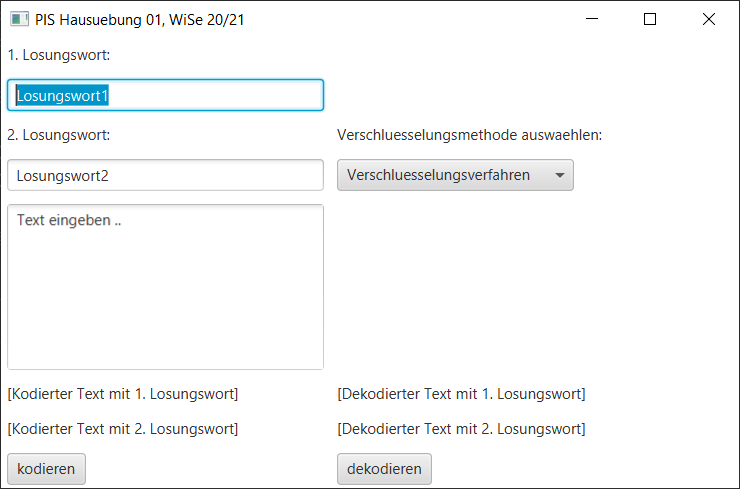

Autorin: Neha K.

##### Inhaltsverzeichnis

- [Kurzbeschreibung](#kurzbeschreibung)
- [Screenshot zur Anwendung](#screenshot-zur-Anwendung)
- [Bedienungshinweise](#bedienungshinweise)
- [Zur Dateiübersicht](#datei%C3%BCbersicht)
    - [Zur Übersicht der Lines of Code LoC](#%C3%BCbersicht-der-lines-of-code-loc)
- [Quellenangaben](#quellen)

## Kurzbeschreibung 
Bei diesem Programm handelt es sich um zwei Verschlüsselungsverfahren:

Das Doppelwuerfel-Verfahren ist für die Kodierung/Dekodierung einer Nachricht gedacht. 
Dabei wird eine Spaltentransposition zweifach angewandt. 
Bei der Ausgabe werden zwei verschlüsselte Nachrichten (nach Anzahl angewendenter Losungsworte) angezeigt.
Für diese Verschlüsselungsart werden zwei Losungsworte (bzw. auch "geheime Schlüssel") benötigt.

Bei der Caesar-Verschlüsselungsverfahren  wird jeder Buchstabe der Nachricht um eine bestimmte Zahl im Alphabet weitergeschoben. 
Diese Zahl ist der 1. Losungswort. 

Die eingegebene Nachricht kann auch dekodiert werden. 
Es wird hierbei vorrausgesetzt, dass die eingegebene Nachricht eine verschlüsselte Nachricht ist 
und die zwei eingegebene Losungsworte benötigt um dekodiert zu werden.
 

## Screenshot zur Anwendung


## Bedienungshinweise

PIS-Ordner öffnen,
Programm mit `gradle run` starten, dabei das Fenster im Fokus bringen (Mausklick).
Mit `gradle test` die Testfälle ausführen.

## Dateiübersicht
```
\gradlew
\gradlew.bat
\README.md
\Screenshot.PNG
\settings.gradle
\app\build.gradle
\app\src\main\java\pis\hue1\App.java
\app\src\main\java\pis\hue1\Caesar.java
\app\src\main\java\pis\hue1\Codec.java
\app\src\main\java\pis\hue1\CodecGUI.java
\app\src\main\java\pis\hue1\Wuerfel.java
\src\test\java\pis\hue1\CodecTest.java
\gradle\wrapper\gradle-wrapper.jar
\gradle\wrapper\gradle-wrapper.properties
```

### Übersicht der Lines of Code LoC
```
-------------------------------------------------------------------------------
Language                     files          blank        comment           code
-------------------------------------------------------------------------------
Java                             6             57            195            346
XML                              7              0              0            222
Bourne Shell                     1             23             36            126
DOS Batch                        1             21              2             66
Markdown                         1             13              0             55
Gradle                           2              9             22             28
-------------------------------------------------------------------------------
SUM:                            18            123            255            842
-------------------------------------------------------------------------------
```